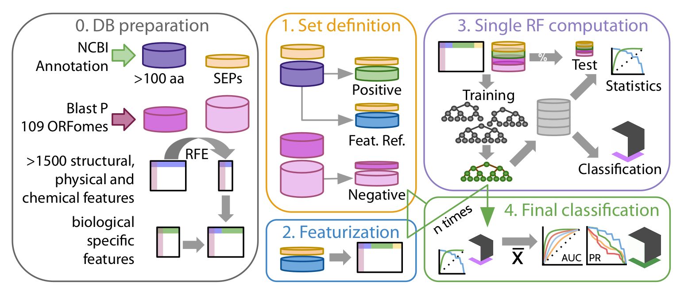

----

<p align="center">
  
</p>


RanSEPs provides a framework for bacterial genome re-annotation and novel small proteins (SEPs) detection adjusting the search to different genomic features that govern protein-coding capabilities.

# How does RanSEPs work?

<center></center>

Original publication with full description of methods can be found [here](XXXXX).

# Preparation

RanSEPs requires:
  - Python: version 2.7 or higher. We have not tested it in version 3.
  - Propy: tool to compute protein features. Instructions for downloading [here](https://www.researchgate.net/publication/235922761_UserGuide_for_propy).
  - Blast: database generation requires to run this program locally. Find information for downloadind and installation [here](https://www.ncbi.nlm.nih.gov/guide/howto/run-blast-local/).

# Installation

Specific libraries are required by RanSEPs to compute certain processes in their predictions. We provide a [requirements](./requirements.txt) file to install everything at once. To do so, you will need first to have [pip](https://pip.pypa.io/en/stable/installing/) installed and then run:

```bash
sudo apt-get install python-pip    # if you need to install pip
pip install -r requirements.txt
```

Then, move to RanSEPs directory and install the program typing:

```bash
sudo python setup.py install
```

After this you will have access to the program just typing `ranseps` in your command line.

# Usage

In order to run a prediction you will only a pair of files:
  - **Genome of reference** in fasta file.
  - The annotated **CDS** in **nucleotidic sequences** annotated in that genome in fasta.

Then just:

```bash
# Custom CDS
ranseps -g <path/to/your/fasta_or_genbank> -c <path/to/your/cds/file>
# Using the CDS from a genbank
ranseps -g <path/to/your/genbank>
```

This will run a simple search for proteins with size higher than 10 amino acids. However, RanSEPs allows multiple sets of parameters to explore and find the best set for your organism of interest. To check them execute:

```bash
ranseps -h
```

# Output

Once the program has run without problems (we really hope it!), you will find in your selected directory:
   - A tab delimited file with all the sequences, their location, RanSEPs score and standard deviation and nt and aa sequences. We recommend a threshold of >= 0.5 to trust a SEP and >=0.85 for standard proteins.
   - Precission-recall and ROC curves to assess the accuracy of your prediction.
   - The weights and errors for each feature considered.

If this output is not enough, RanSEPs will generate a *intermediary_folder* including all databases, annotation files, amino acidic and nucleotidic sequences in fasta files and classifiers, features and statistics for each classification subprocess (more information in online methods of the original publication). You can remove this folder safely if you have enough with the default results.


# RanSEPs as a python package

You can import RanSEPs to use it as an implemented function in any of your python scripts. To do so, just follow the previous installation steps and import the main function using:

```python
from ranseps.run_ranseps import run_ranseps
```

Then you will be able to run the tool in any script using:

```python
run_ranseps(<path/to/your/genome> , <path/to/your/cds/file>)
```

All the additional arguments present in the desktop version are available in the python function, to check the documentation interactively in python interpreter you can use:

```python
help(run_ranseps)
```

# Versions

- *v_1*: added predictor of pseudogenes based in homology
- *v_2*:
  - pseudorandomized mode
  - fixed set sizes options
  - average probability per prediction optimized
  - autonegative set


# Contact

This project has been fully developed at [Centre for Genomic Regulation](http://www.crg.eu/) at the group of [Design of Biological Systems](http://www.crg.eu/en/luis_serrano).

If you experience any problem at any step involving the program, you can use the 'Issues' page of this repository or contact:

[Miravet-Verde, Samuel](mailto:samuel.miravet@crg.eu)       
[Lluch-Senar, Maria](mailto:maria.lluch@crg.eu)       
[Serrano, Luis](mailto:luis.serrano@crg.eu)

# License

RanSEPs is under a common GNU GENERAL PUBLIC LICENSE. Plese, check [LICENSE](./LICENSE) for further information.

*[2018] - Centre de Regulació Genòmica (CRG) - All Rights Reserved*

